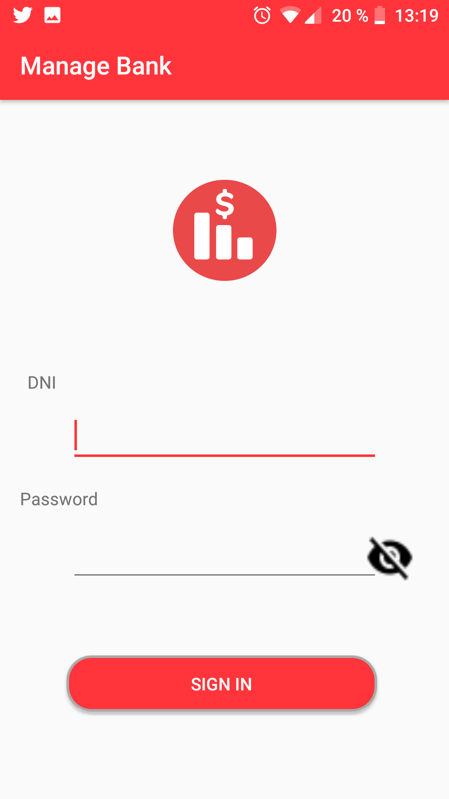
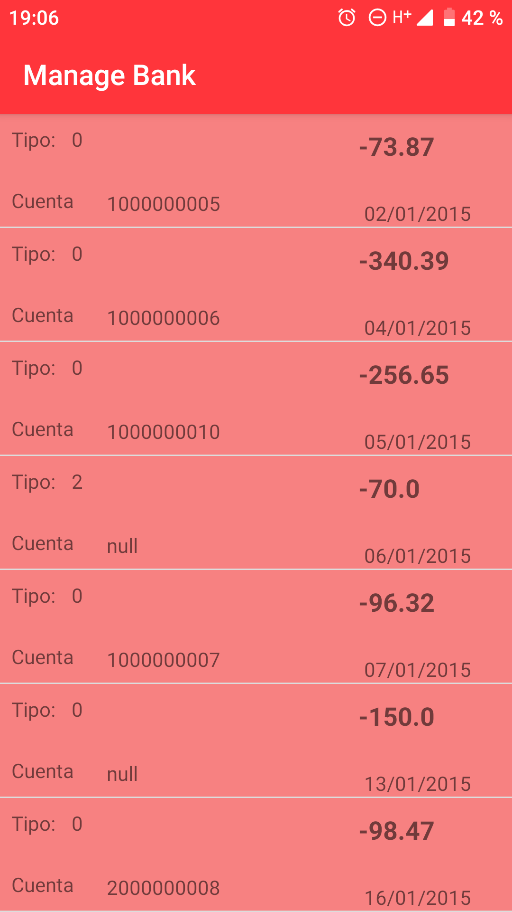
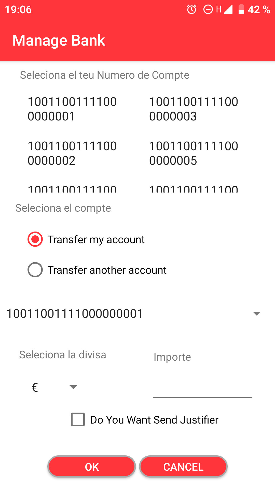
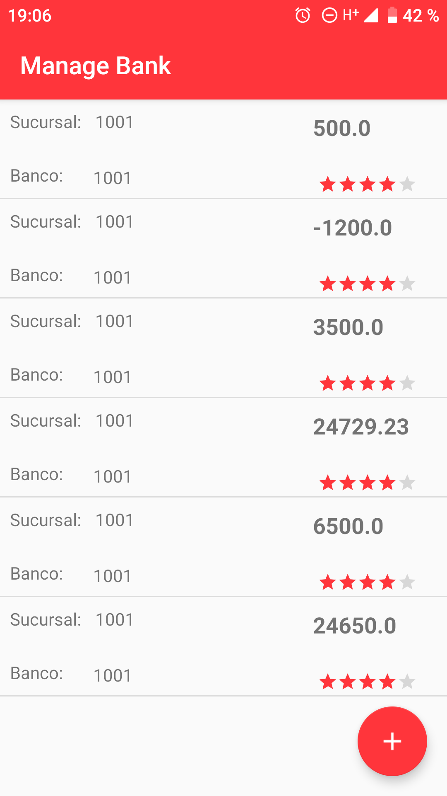
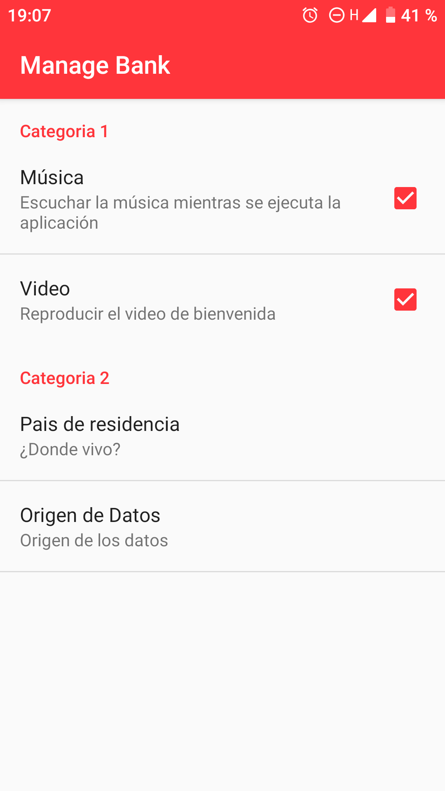

#TODO
### I must change the id of input new password in change password Activity for old password id in land, xlarge and  xlange-land
# Manage Bank
 

## Screens of my app

| Slash Screen | Login Screen |
|-----|-----|
|

|List Transactions Screen |Transactions Screen|
|------|------|
|

|List Charge Screen |Settings Screen |
|-----|-----|
|